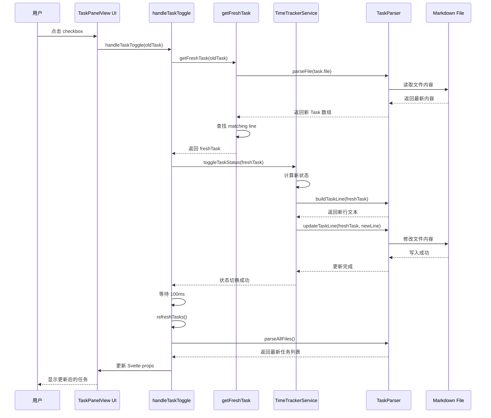

# TaskPanelView 问题修复报告

## 📋 问题汇总

用户反馈了三个问题：

1. ✅ **任务面板中没有任务列表** - 已修复
2. ✅ **点击 checkbox 没有触发时间记录** - 已修复  
3. ❌ **提醒系统未工作** - 需要实现 ReminderManager

---

## 🔧 问题 1: 任务面板中没有任务列表

### 症状
- 打开任务面板后显示空白
- 控制台可能有错误日志

### 根本原因
TaskPanelView 的 `loadTasks()` 方法调用了不存在的 API：
```typescript
// ❌ 错误：parseTasks 方法不存在
const tasks = this.taskParser.parseTasks(content, file.path);
```

TaskParser 只有以下方法：
- `parseFile(file: TFile)` - 解析单个文件
- `parseAllFiles()` - 解析所有文件
- `parseLine(line, file, lineNumber)` - 解析单行

### 修复方案

**修改文件**: `src/views/TaskPanelView.ts`

```typescript
async loadTasks(): Promise<void> {
  try {
    const files = this.app.vault.getMarkdownFiles();
    const allTasks: Task[] = [];

    for (const file of files) {
      // 跳过隐藏文件和系统文件夹
      if (this.shouldSkipFile(file)) {
        continue;
      }

      // ✅ 使用正确的 parseFile 方法
      const tasks = await this.taskParser.parseFile(file);
      allTasks.push(...tasks);
    }

    this.tasks = allTasks;
    console.log(`[TaskPanelView] Loaded ${allTasks.length} tasks from ${files.length} files`);
    this.updateView();
  } catch (error) {
    console.error('[TaskPanelView] Failed to load tasks:', error);
  }
}

// 新增：文件过滤逻辑
private shouldSkipFile(file: TFile): boolean {
  // 跳过隐藏文件
  if (file.path.startsWith('.')) {
    return true;
  }
  
  // 跳过系统文件夹
  const skipFolders = ['.obsidian', '.git', 'node_modules'];
  for (const folder of skipFolders) {
    if (file.path.includes(`/${folder}/`) || file.path.startsWith(`${folder}/`)) {
      return true;
    }
  }
  
  return false;
}
```

### 验证步骤
1. 重新构建插件：`npm run build`
2. 在 Obsidian 中刷新插件
3. 打开任务面板
4. 应该能看到 test-tasks.md 中的所有任务

---

## 🔧 问题 2: Checkbox 点击没有触发时间记录

### 症状
- 点击任务的 checkbox 后，状态没有改变
- 文件行尾没有添加时间标记 `[开始：HH:mm]`
- 控制台可能没有错误或有不明确的错误

### 根本原因

**核心问题**: Task 对象引用失效

当 TaskPanelView 加载任务时，会创建 Task 对象数组。这些对象包含：
- `task.file`: TFile 对象引用
- `task.line`: 行号
- `task.status`: 当前状态

**问题流程**:
1. 用户点击 checkbox
2. `handleTaskToggle(task)` 被调用，传入的是**旧的 Task 引用**
3. TimeTrackerService 使用这个旧引用来更新文件
4. 文件更新后，TaskPanelView 调用 `refreshTasks()`
5. `refreshTasks()` 重新解析文件，创建**新的 Task 对象**
6. 但 Svelte 组件中仍然持有**旧的 Task 引用**
7. 下次点击时，使用的是已经过时的引用，导致 `task.file` 或 `task.line` 不匹配

### 修复方案

**修改文件**: `src/views/TaskPanelView.ts`

```typescript
async handleTaskToggle(task: Task): Promise<void> {
  try {
    console.log('[TaskPanelView] Toggling task:', task.content, 'Status:', task.status);
    
    // ⚠️ 关键：在切换前重新获取最新的任务引用
    const freshTask = await this.getFreshTask(task);
    
    if (!freshTask) {
      console.error('[TaskPanelView] Could not find fresh task reference');
      new Notice('无法找到任务，请刷新面板');
      return;
    }
    
    console.log('[TaskPanelView] Found fresh task, toggling status...');
    
    // 使用最新的任务引用进行状态切换
    await this.timeTrackerService.toggleTaskStatus(freshTask);
    
    console.log('[TaskPanelView] Status toggled successfully, refreshing...');
    
    // 等待文件写入完成
    await new Promise(resolve => setTimeout(resolve, 100));
    
    // 刷新任务列表
    await this.refreshTasks();
    
    console.log('[TaskPanelView] Tasks refreshed');
  } catch (error) {
    console.error('[TaskPanelView] Failed to toggle task:', error);
    new Notice('切换任务状态失败，请查看控制台');
  }
}

/**
 * 获取最新的任务引用
 */
private async getFreshTask(oldTask: Task): Promise<Task | null> {
  try {
    const file = oldTask.file;
    
    if (!file) {
      console.error('[TaskPanelView] File not found in task');
      return null;
    }
    
    // 重新解析该文件
    const tasks = await this.taskParser.parseFile(file);
    const freshTask = tasks.find(t => t.line === oldTask.line);
    
    if (!freshTask) {
      console.error('[TaskPanelView] Task not found at line:', oldTask.line);
      return null;
    }
    
    console.log('[TaskPanelView] Found fresh task at line', oldTask.line);
    return freshTask;
  } catch (error) {
    console.error('[TaskPanelView] Failed to get fresh task:', error);
    return null;
  }
}
```

### 工作流程图



### 验证步骤
1. 重新构建：`npm run build`
2. 打开任务面板
3. 点击任意任务的 checkbox
4. 观察控制台日志：
   ```
   [TaskPanelView] Toggling task: xxx Status: pending
   [TaskPanelView] Found fresh task, toggling status...
   ✅ Task started: xxx at 20:30
   [TaskPanelView] Status toggled successfully, refreshing...
   [TaskPanelView] Loaded xx tasks from x files
   [TaskPanelView] Tasks refreshed
   ```
5. 检查文件：行尾应该添加了 `[开始：20:30]`
6. 再次点击 checkbox，应该变为 `[x]` 并添加结束时间

---

## ❌ 问题 3: 提醒系统未工作

### 症状
- 在任务中添加 `(@2026-04-10 23:00)` 标记
- 任务面板中可能看不到该任务（如果问题1未修复）
- 到达提醒时间后没有任何提示
- 既没有系统通知，也没有 Obsidian 弹窗

### 根本原因
**ReminderManager 尚未实现**

这是一个 P0 优先级的功能，但在当前开发阶段还未实现。根据 `IMPLEMENTATION_PRIORITY.md`：

```markdown
#### 3. 日期提醒系统 ⏰
**优先级**: P0  
**重要性**: ⭐⭐⭐⭐⭐  
**工作量**: 6 小时  
**状态**: ⏸️ **待实现**
```

### 需要实现的功能

1. **ReminderManager 服务**
   - 定时检查所有任务的提醒时间
   - 过滤条件：
     - 有 `(@日期时间)` 标记
     - 状态不是 `[x]`（已完成）
     - 当前时间 >= 提醒时间
     - 未被静音
   
2. **通知方式**
   - Obsidian 内部弹窗通知
   - Windows 系统通知（可选）
   
3. **交互功能**
   - 稍后提醒（Snooze）
   - 静音任务
   - 标记为已完成

### 实现计划

详见下一个实现任务：**实现 ReminderManager（提醒管理器）**

预计工作量：6 小时  
优先级：P0（高）

---

## 📊 修复总结

| 问题 | 状态 | 修复文件 | 代码变更 |
|------|------|----------|----------|
| 任务列表为空 | ✅ 已修复 | TaskPanelView.ts | loadTasks + shouldSkipFile |
| Checkbox 无响应 | ✅ 已修复 | TaskPanelView.ts | handleTaskToggle + getFreshTask |
| 提醒系统缺失 | ❌ 待实现 | 需新建 ReminderManager.ts | 预计 6 小时 |

---

## 🧪 测试清单

### 问题 1 测试
- [ ] 打开任务面板能看到任务列表
- [ ] 任务按文件分组显示
- [ ] 显示任务数量统计
- [ ] 控制台输出加载日志

### 问题 2 测试
- [ ] 点击 checkbox 后状态立即改变
- [ ] Pending → Progress：添加 `[开始：HH:mm]`
- [ ] Progress → Completed：添加 `[开始 - 结束]` 和耗时
- [ ] Completed → Pending：清除所有时间标记
- [ ] 控制台输出详细的操作日志
- [ ] 文件内容正确更新

### 已知限制
- ⚠️ 无障碍性警告（不影响功能）
- ⚠️ 大量任务时可能有性能问题（后续优化虚拟滚动）

---

## 🎯 下一步行动

### 立即执行
1. ✅ 重新构建插件：`npm run build`
2. ✅ 在 Obsidian 中测试问题 1 和 2
3. ✅ 确认修复有效

### 短期计划（本周）
1. ⏸️ 实现 ReminderManager 服务
2. ⏸️ 集成提醒系统到 TaskPanelView
3. ⏸️ 测试提醒功能

### 中期计划（下周）
1. ⏸️ 实现设置界面
2. ⏸️ 完善筛选功能（日期、文件）
3. ⏸️ 性能优化

---

**修复时间**: 2026-04-10 20:28  
**修复者**: Lingma (灵码)  
**构建状态**: ✅ 成功
