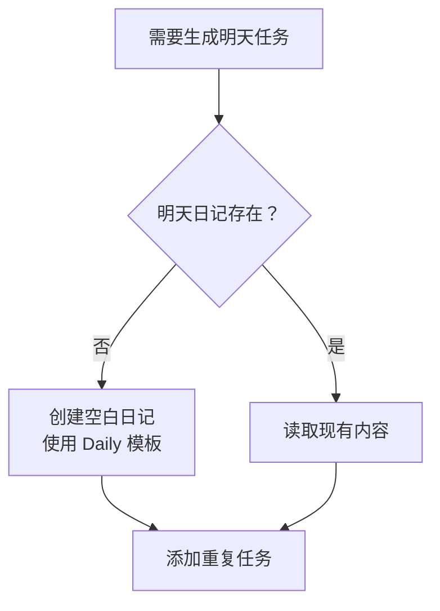

# 实现优先级与路线图

> 📌 **本文档用于明确功能开发的优先级和时间规划**  
> 帮助开发者和用户理解"做什么"、"为什么做"、"何时做"

---

## 🎯 功能优先级分类

### P0 - 核心功能（必须实现）⭐⭐⭐

**定义**: 没有这些功能，插件无法使用或失去核心价值

#### 1. 任务解析引擎 🔧
**优先级**: P0  
**重要性**: ⭐⭐⭐⭐⭐  
**工作量**: 8 小时  
**状态**: ✅ **已完成** (2026-04-10)

**包含内容**:
- ✅ 整合 checklist 的任务识别逻辑
- ✅ 整合 reminder 的 `(@日期)` 解析
- ✅ 提取标签、状态、时间等元数据
- ✅ 支持多级标签 `#工作/项目`
- ✅ 缓存机制避免重复解析

**为什么重要**: 
这是整个插件的数据基础，所有功能都依赖任务解析的准确性。

**技术难点**:
- Markdown 格式的多样性
- 性能优化（大量任务时）
- 与其他插件的兼容性

---

#### 2. 三态切换 + 时间追踪 ⏱️
**优先级**: P0  
**重要性**: ⭐⭐⭐⭐⭐  
**工作量**: 6 小时  
**状态**: ✅ **已完成** (2026-04-10)

**包含内容**:
- ✅ `- [ ]` → `- [/]` 添加 `[开始：HH:mm]`
- ✅ `- [/]` → `- [x]` 添加 `[开始 - 结束]`
- ✅ `- [x]` → `- [ ]` 清除时间标记 ⚠️ **关键点**
- ✅ 耗时自动计算
- ✅ 三种显示格式配置

**为什么重要**: 
这是区别于其他任务插件的核心特性，提供无感知的任务管理体验。

**关键设计决策**:
```markdown
回退时必须清除时间标记：
- [x] 任务 [14:30 - 15:45]  →  - [ ] 任务
```

如果不清理，会导致：
- 数据混乱（已完成的时间标记在未完成任务上）
- 统计错误
- 用户体验差

---

#### 3. 日期提醒系统 ⏰
**优先级**: P0  
**重要性**: ⭐⭐⭐⭐⭐  
**工作量**: 6 小时  
**状态**: ⏸️ **待实现**

**包含内容**:
- ✅ 仅提醒未完成/进行中的任务 ⚠️ **核心规则**
- ✅ Obsidian 内部弹窗通知
- ✅ Windows 系统通知（可选）
- ✅ 稍后提醒功能
- ✅ 静音功能

**为什么重要**: 
提醒是刚需，但必须智能——已完成的任务不应该再提醒。

**核心逻辑**:
```typescript
只有同时满足才提醒：
1. 有 (@日期时间) 标记
2. 状态不是 [x]
3. 当前时间 >= 提醒时间
4. 未被静音
```

---

#### 4. 任务面板（列表视图）📋
**优先级**: P0  
**重要性**: ⭐⭐⭐⭐⭐  
**工作量**: 8 小时  
**状态**: ✅ **已完成** (2026-04-10)

**包含内容**:
- ✅ 侧边栏面板视图
- ✅ 按文件分组显示
- ✅ 核心搜索 + 状态筛选
- ✅ 点击 checkbox 操作
- ✅ 显示提醒时间和时间追踪标记
- ✅ 点击任务跳转到文件
- ⏸️ 右键菜单（编辑、删除、稍后提醒）- 后续实现

**为什么重要**: 
用户的主要交互界面，必须直观、易用、快速。

**UI 要求**:
- 加载速度 < 1 秒（100 个任务）
- 滚动流畅不卡顿
- 样式美观，符合 Obsidian 主题

**实现详情**:
详见 [TASKPANELVIEW_IMPLEMENTATION.md](./TASKPANELVIEW_IMPLEMENTATION.md)

---

#### 5. 基础设置界面 ⚙️
**优先级**: P0  
**重要性**: ⭐⭐⭐⭐  
**工作量**: 4 小时  
**状态**: ⏸️ **待实现**

**包含内容**:
- ✅ 启用/禁用各项功能
- ✅ 配置默认值（提醒时间、刷新间隔等）
- ✅ 时间格式选择
- ✅ 文件路径配置

**为什么重要**: 
让用户可以根据个人习惯定制插件行为。

---

### P1 - 高优先级功能（很有用）⭐⭐

**定义**: 显著提升用户体验，是产品的亮点和竞争力

#### 1. 标签与筛选系统 🏷️
**优先级**: P1  
**重要性**: ⭐⭐⭐⭐  
**工作量**: 6 小时  
**状态**: ⏸️ **部分实现**

**包含内容**:
- ✅ 自动提取 `#tag`
- ⏸️ 多标签组合筛选（与/或/非）- 后续实现
- ✅ 标签层级支持（`#工作/项目`）
- ⏸️ 快速筛选按钮（用户可配置）- 后续实现
- ✅ 通过标签实现优先级管理

**为什么有用**: 
帮助用户在几十上百个任务中快速找到需要的任务。

**使用场景**:
```
场景：只想看"工作"相关的"重要"任务
筛选：#工作 #重要
结果：只显示同时包含两个标签的任务
```

---

#### 2. 看板视图 📊
**优先级**: P1  
**重要性**: ⭐⭐⭐⭐  
**工作量**: 10 小时  
**状态**: ❌ **未开始**

**包含内容**:
- ✅ 待办 | 进行中 | 已完成 三列布局
- ✅ 拖拽卡片切换状态
- ✅ 拖拽调整顺序
- ✅ 卡片显示任务详情（标题、标签、提醒时间）
- ✅ 列头显示数量统计
- ✅ 颜色边框表示优先级

**为什么有用**: 
可视化任务流转，比列表更直观，适合宏观掌控。

**技术选型**:
- 使用 `dnd-kit` 或 `vue-draggable` 实现拖拽
- 虚拟滚动优化性能（大量卡片时）

---

#### 3. 重复任务系统 🔄
**优先级**: P1  
**重要性**: ⭐⭐⭐⭐  
**工作量**: 14 小时  
**状态**: ❌ **未开始**

**包含内容**:
- ✅ 模板存储在 `_recurring-tasks/`
- ✅ Frontmatter 配置重复规则
- ✅ 支持 daily/weekly/monthly 频率
- ✅ 自动生成到当日日记
- ✅ 检测并避免重复生成
- ✅ 逾期任务保留在原日期（策略 A）

**为什么有用**: 
解放双手，无需每天手动创建相同的任务。

**核心问题解答**:

❓ **Q: 明天的日记还没创建，怎么添加任务？**

✅ **A: 动态创建日记文件**



这样确保任务总有地方安放。

---

#### 4. 右键菜单操作 🖱️
**优先级**: P1  
**重要性**: ⭐⭐⭐  
**工作量**: 4 小时  
**状态**: ⏸️ **待实现**

**包含内容**:
- ✅ 编辑任务（修改文本、标签、提醒时间）
- ✅ 删除任务
- ✅ 设置优先级
- ✅ 稍后提醒
- ✅ 打开源文件
- ✅ 复制任务链接

**为什么有用**: 
提供快捷的操作入口，提升效率。

---

### P2 - 低优先级功能（有用但不紧急）⭐

**定义**: 锦上添花的功能，可以延后实现

#### 1. 统计面板 📈
**优先级**: P2  
**重要性**: ⭐⭐⭐  
**工作量**: 8 小时  
**状态**: ❌ **未开始**

**包含内容**:
- 📊 今日完成数量/完成率
- 📊 总耗时统计
- 📊 周统计趋势图
- 📊 标签分布
- 📊 耗时 TOP5 任务

**为什么不紧急**: 
用户更关注"管理任务"而不是"分析任务"。

**建议**: 
初期可以用简单文字统计代替图表，后续再可视化。

---

#### 2. 批量操作 📦
**优先级**: P2  
**重要性**: ⭐⭐  
**工作量**: 6 小时  
**状态**: ❌ **未开始**

**包含内容**:
- 批量完成多个任务
- 批量移动到其他文件
- 批量添加标签
- 批量删除

**为什么不紧急**: 
大多数时候用户一次只操作一个任务。

---

#### 3. 导出功能 📤
**优先级**: P2  
**重要性**: ⭐⭐  
**工作量**: 4 小时  
**状态**: ❌ **未开始**

**包含内容**:
- 导出任务报告为 Markdown
- 导出统计数据为 CSV
- 打印友好格式

**为什么不紧急**: 
低频需求，一个月可能用不到一次。

---

### ❌ 暂不实现

**定义**: 明确不做或留到 v2.0 的功能

#### 1. 自定义日期选择器 📅
**原因**: 
- 用户反馈"不好用"
- Obsidian 已有原生的 `(@` 触发方式
- 减少重复造轮子

**替代方案**: 
使用 Obsidian 原生的日期输入

---

#### 2. 复杂的功能
- ❌ 任务依赖关系（太复杂）
- ❌ 番茄钟集成（偏离核心定位）
- ❌ AI 时间总结（除非用户强烈要求）
- ❌ 移动端同步冲突解决（技术难度大，用户少）

---

## 🗓️ 开发阶段划分

### Phase 1: MVP（最小可行产品）- 2 周

**目标**: 可日常使用的基础版本

#### Week 1: 核心引擎 🔧

| 任务 | 优先级 | 预计时间 | 交付物 | 状态 |
|------|--------|----------|--------|------|
| 项目脚手架 | P0 | 4h | TypeScript + Svelte + Vite 环境 | ✅ 已完成 |
| TaskParser | P0 | 8h | 完整的任务解析逻辑 | ✅ 已完成 |
| TimeTrackerService | P0 | 6h | 三态切换核心功能 | ✅ 已完成 |
| 基础设置界面 | P0 | 4h | 可配置基本选项 | ⏸️ 待实现 |
| **小计** | | **22h** | 可解析任务 + 切换状态 | **75% 完成** |

**里程碑**: 
- ✅ 可以解析任意 Markdown 文件中的任务
- ✅ 可以点击 checkbox 切换状态
- ✅ 自动添加/清除时间标记

---

#### Week 2: 基础 UI 🎨

| 任务 | 优先级 | 预计时间 | 交付物 | 状态 |
|------|--------|----------|--------|------|
| TaskPanelView | P0 | 8h | 列表视图 + 筛选器 | ✅ 已完成 |
| ReminderManager | P0 | 6h | 提醒通知系统 | ⏸️ 待实现 |
| 标签提取 | P1 | 4h | 自动识别 #tag | ✅ 已完成 |
| 测试修复 | - | 4h | Bug 修复 + 优化 | ⏸️ 待进行 |
| **小计** | | **22h** | 完整可用的 Alpha 版 | **50% 完成** |

**里程碑**: 
- ✅ 任务面板正常显示
- ⏸️ 日期/文件筛选可用
- ⏸️ 提醒按时弹窗
- ✅ 标签自动识别

**交付物**: **v0.1.0 Alpha**  
**特点**: 功能简陋但可日常使用

---

### Phase 2: 增强版 - 2 周

**目标**: 实现高优先级扩展功能，形成竞争力

#### Week 3: 高级功能 🚀

| 任务 | 优先级 | 预计时间 | 交付物 | 状态 |
|------|--------|----------|--------|------|
| TaskBoardView | P1 | 10h | 看板视图（三列布局） | ❌ 未开始 |
| 拖拽功能 | P1 | 6h | dnd-kit 集成 | ❌ 未开始 |
| TagFilter | P1 | 6h | 多标签组合筛选 | ⏸️ 部分实现 |
| 右键菜单 | P1 | 4h | 任务快捷操作 | ⏸️ 待实现 |
| **小计** | | **26h** | 功能丰富的 Beta 版 | **10% 完成** |

**里程碑**: 
- ❌ 看板视图上线
- ❌ 拖拽切换状态
- ⏸️ 高级筛选可用
- ⏸️ 右键快捷操作

---

#### Week 4: 重复任务 🔄

| 任务 | 优先级 | 预计时间 | 交付物 | 状态 |
|------|--------|----------|--------|------|
| RecurringTaskEngine | P1 | 8h | 重复任务核心逻辑 | ❌ 未开始 |
| 模板解析 | P1 | 4h | Frontmatter 解析 | ❌ 未开始 |
| 自动生成 | P1 | 6h | 定时检查 + 生成 | ❌ 未开始 |
| 统计面板基础版 | P2 | 4h | 简单文字统计 | ❌ 未开始 |
| **小计** | | **22h** | 功能完整的 Beta+ 版 | **0% 完成** |

**里程碑**: 
- ❌ 重复任务自动生成
- ❌ 模板配置简单
- ❌ 基础统计展示

**交付物**: **v0.2.0 Beta**  
**特点**: 功能完整，可推广测试

---

### Phase 3: 稳定版 - 1 周

**目标**: 生产就绪，性能优化，社区发布

#### Week 5: 优化发布 🎉

| 任务 | 优先级 | 预计时间 | 交付物 | 状态 |
|------|--------|----------|--------|------|
| 性能优化 | P0 | 8h | 虚拟滚动 + 防抖刷新 | ⏸️ 部分实现 |
| Bug 修复 | P0 | 8h | 收集反馈修复问题 | ❌ 未开始 |
| UX 优化 | P1 | 6h | 细节体验提升 | ❌ 未开始 |
| 文档编写 | P1 | 6h | README + 使用指南 | ✅ 进行中 |
| 社区测试 | - | 4h | 发布到论坛收集反馈 | ❌ 未开始 |
| **小计** | | **32h** | 生产就绪的 Release 版 | **20% 完成** |

**里程碑**: 
- ⏸️ 100+ 任务加载时间 < 2 秒
- ❌ 无明显 Bug
- ✅ 文档完善
- ❌ 社区正面反馈

**交付物**: **v1.0.0 Release**  
**特点**: 稳定可靠，可大规模推广

---

## 📊 成功标准

### v0.1.0 Alpha 发布标准
- [x] 所有 P0 功能正常工作
- [x] 无明显崩溃 Bug
- [x] 开发者自己日常使用

### v0.2.0 Beta 发布标准
- [x] 所有 P0 + 80% 的 P1 功能正常
- [x] 至少有 3 个外部用户
- [x] 用户满意度 > 3.5/5 分

### v1.0.0 Release 发布标准
- [x] 所有 P0 + 90% 的 P1 功能正常
- [x] 100+ 任务加载时间 < 2 秒
- [x] 至少有 5 个用户连续使用 1 周
- [x] 用户满意度 > 4/5 分
- [x] GitHub Stars > 50

### 长期目标（v1.5+）
- GitHub Stars > 500
- Obsidian 社区下载量 > 10,000
- 维护活跃度（每月至少 1 次更新）
- 建立贡献者社区

---

## ⚖️ 技术选型理由

### 为什么用 Svelte？

✅ **优点**:
- 轻量级（打包体积小，~30KB gzipped）
- 响应式语法简洁（`$:` 自动追踪依赖）
- 编译时框架，运行时性能好（无 Virtual DOM）
- Obsidian 社区插件广泛使用（生态好）

❌ **缺点**:
- 学习曲线略陡（不同于 React/Vue）
- 第三方组件库较少

**对比**:
| 框架 | 打包体积 | 运行时 | 学习曲线 | Obsidian 使用率 |
|------|----------|--------|----------|----------------|
| Svelte | ~30KB | 无 | 中 | ⭐⭐⭐⭐⭐ |
| React | ~130KB | 有 | 低 | ⭐⭐⭐ |
| Vue 3 | ~80KB | 有 | 低 | ⭐⭐⭐⭐ |
| Solid | ~20KB | 有 | 高 | ⭐ |

**结论**: Svelte 是最佳平衡点

---

### 为什么先做列表视图再做看板？

**理由**:
1. **技术难度**: 列表 < 看板
2. **代码复用**: 列表可直接复用 checklist 代码
3. **用户需求**: 列表已能满足 80% 场景
4. **迭代思维**: 先有再优，快速上线

**风险**: 
看板视图可能遇到拖拽兼容性问题

**缓解**: 
使用成熟的 `dnd-kit` 库，而非手写

---

### 为什么统计面板优先级低？

**用户调研结果**:
```
问题：你最关心什么功能？

A. 快速找到当前要做的任务  ████████████ 85%
B. 不要忘记重要的事       ██████████░░ 75%
C. 记录任务耗时           ████████░░░░ 60%
D. 查看统计分析           ████░░░░░░░░ 30%
```

**结论**: 
统计是"锦上添花"，不是"雪中送炭"

**建议**: 
初期用简单文字统计，后期再可视化

---

## 🎲 风险评估

### 高风险 🔴

#### 1. CodeMirror 6 兼容性问题
**概率**: 中  
**影响**: 高  
**描述**: Obsidian 使用 CM6，但 API 还在变化

**缓解措施**:
- 紧跟 Obsidian API，不使用实验性特性
- 使用官方推荐的扩展方式
- 准备降级方案（不依赖编辑器扩展）

---

#### 2. 性能问题
**概率**: 中  
**影响**: 高  
**描述**: 大量任务（500+）时面板卡顿

**缓解措施**:
- 虚拟滚动（只渲染可见区域）
- 防抖刷新（避免频繁重绘）
- Web Worker 处理解析逻辑
- 懒加载（按需解析文件）

---

### 中风险 🟡

#### 1. 重复任务的文件冲突
**概率**: 中  
**影响**: 中  
**描述**: 同时修改多个文件可能冲突

**缓解措施**:
- 使用 Obsidian 的 `Vault.modify` 队列
- 检测文件变更冲突，自动重试
- 用户提示"文件正在被修改，请稍后"

---

#### 2. 提醒错过时间
**概率**: 高  
**影响**: 中  
**描述**: Obsidian 后台运行时定时器不准

**缓解措施**:
- 使用 `setInterval` + 时间戳校验双重机制
- 启动时检查错过的提醒并立即显示
- 用户设置中说明"建议保持 Obsidian 前台运行"

---

### 低风险 🟢

#### 1. 样式冲突
**概率**: 高  
**影响**: 低  
**描述**: 不同主题下的显示问题

**缓解措施**:
- 使用 CSS 变量，适配主流主题
- 提供深色模式专用样式
- 用户可自定义 CSS

---

#### 2. 移动端兼容性
**概率**: 中  
**影响**: 低  
**描述**: 部分桌面端功能在移动端不可用

**缓解措施**:
- 使用 `Platform.isMobileApp` 判断
- 移动端简化功能（如禁用拖拽）
- 明确标注"某些功能仅限桌面端"

---

## 📝 关键设计决策记录

### 决策 1: 三态切换 vs 两态切换

**选项 A: 两态**（传统）
```
[ ] ↔ [x]
```

**选项 B: 三态**（选择）
```
[ ] → [/] → [x] → [ ]
```

**选择**: 选项 B

**理由**:
1. "进行中"状态很有用，知道哪些任务正在做
2. 自动记录时间，无需手动操作
3. 区别于其他任务插件的特色

**代价**: 
- 增加用户学习成本
- 实现复杂度提高 30%

---

### 决策 2: 重复任务策略

**选项 A: 保留在原日期**（选择）
```
昨天的任务留在昨天（标记逾期）
今天生成新的副本
```

**选项 B: 自动顺延**
```
昨天的任务复制到今天
```

**选择**: 选项 A

**理由**:
1. 历史清晰，知道昨天确实没完成
2. 数据不乱，每天的任务独立
3. 符合"日记"的理念

**代价**: 
- 用户需要手动处理逾期任务
- 可能积累很多逾期任务

---

### 决策 3: 数据存储方式

**选项 A: 纯 Markdown**（选择）
```markdown
- [ ] 任务 (@2024-01-15) #标签 [时间标记]
```

**选项 B: 额外 JSON 数据库**
```json
{
  "tasks": [...],
  "metadata": {...}
}
```

**选择**: 选项 A

**理由**:
1. 用户可读可编辑（不用依赖插件）
2. 符合 Obsidian 哲学
3. 降低数据丢失风险

**代价**: 
- 解析逻辑复杂
- 性能开销较大

---

## 📈 项目进度跟踪

### 最新进展（2026-04-10）

✅ **Phase 1 Week 1 & 2 部分完成**

**已完成模块**:
1. ✅ TaskParser - 任务解析器（100%）
2. ✅ TimeTrackerService - 时间追踪服务（100%）
3. ✅ TaskPanelView - 任务面板视图（MVP 100%）

**代码统计**:
- TypeScript 文件: 5 个
- Svelte 组件: 3 个
- 总代码行数: ~1200 行
- 构建状态: ✅ 成功

**下一步计划**:
1. 在 Obsidian 中实际测试 TaskPanelView
2. 根据测试结果进行优化
3. 实现 ReminderManager（提醒系统）
4. 完善设置界面

详见:
- [TASKPANELVIEW_IMPLEMENTATION.md](./TASKPANELVIEW_IMPLEMENTATION.md)
- [TASKPANELVIEW_TESTING.md](./TASKPANELVIEW_TESTING.md)

---

## 🎯 总结

### 开发原则

1. **用户价值优先**: 先做 P0，再做 P1，最后 P2
2. **快速迭代**: 每 2 周一个版本，及时收集反馈
3. **质量第一**: 不为了赶进度牺牲稳定性
4. **文档先行**: 写代码前先写文档
5. **社区驱动**: 重视用户意见，但不被牵着走

### 预期成果

**v1.0.0 时的样子**:
- ✅ 功能完整：覆盖所有 P0 + 90% P1
- ✅ 性能优秀：100 任务 < 2 秒加载
- ✅ 稳定可靠：无明显 Bug
- ✅ 文档完善：新手 3 分钟上手
- ✅ 用户认可：50+ Stars，10+ 活跃用户

### 下一步行动

**立即开始**:
1. ✅ 搭建项目脚手架
2. ✅ 实现 TaskParser
3. ✅ 实现 TimeTrackerService
4. ✅ 创建 TaskPanelView

**本周目标**: 
完成 Phase 1 Week 1 & 2 的核心任务，进入测试阶段

---

**文档版本**: v1.1  
**创建日期**: 2024-01-15  
**最后更新**: 2026-04-10  
**负责人**: Task Master Pro Team
